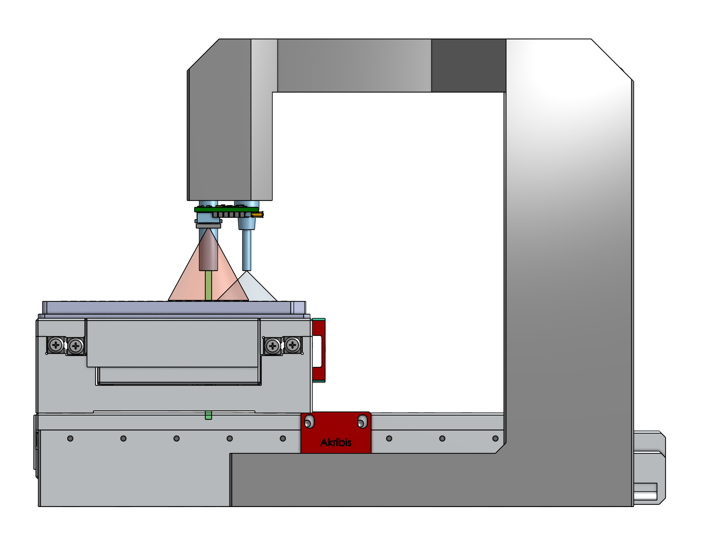

# Liquid Monitor Station Datasheet

 

Add quality control to your assays with Monomer's Liquid Monitor Sensors. These sensors can be used as a standalone device or they can be mounted right on top of your existing instruments. Don't wait till the end of all your experiments to find out about evaporative edge effects or clogged nozzles. Discover those failure modes right when and where they happen. Reagent dispensing has been known to vary by as much as 10% over a 1-day time period. Use our analysis tools to see trends in your own lab over time or across plates for yourself. Get peace of mind that you are drawing real biological conclusions from your data rather than interpreting liquid handling aberrations.

## Features
* Measure liquid level of individual wells or tubes.
* Detect presence or absence of caps, seals, or lids.
* Flag droplets, bubbles, and as of yet unknown anomalies using a spectral camera at the individual well level. (In development.)
* Measure temperature of samples in individual wells. (In development.)
* Cross reference with local recordings of temperature and humidity. (In development.)

## Inline Device Compatibility
 

Measuring inline ensures *all* dispenses are automatically scanned. Labware is scanned on the instrument as its tray extends. Cross reference with commanded volumes and get notified when the dispensing cassette needs to be replaced rather than relying on an arbitrary monthly calendar event. Sensors can be mounted on your existing instruments directly. This obviates needing to make space for an additional instrument or program extra robot arm movements. We support the following devices for inline verification:
* FluidX IntelliXcap
* Multidrop Combi SMART (coming soon)
* PF400 (coming soon)

## Interfaces
* For manual operation use our browser based user interface optimized for collaboration. Try for yourself [here](https://monomerbio.com/demo).
* For automation use our gRPC interface. The API is open and publicly available [here](https://monomerbio.com/api).

## Specifications

### Dimensional Drawings
#### Dimensions with Axes at Neutral Position

#### Keepout Zone for Axes at Extents

All dimensions in millimeters.

### Positioning above Containers for Inline Sensor Array
Use the adjustment screws on the top of the station to set the reference mounting distance of the sensors above microtiter plate wells or tubes.

### Electrical Requirements for Inline Sensor Array
Power: 15-30 V DC, <=35 mA per sensor

Portrait mode (8 sensors): 280 mA

Landscape mode (12 sensors): 420 mA

### Volume Accuracy Table
| Labware Type | Precision [%] | Accuracy [%] | Precision [uL] | Accuracy [uL] | Max Volume [uL] | Notes |
| --- | --- | --- | --- | --- | --- | --- |
| 384-well v-bottom (Greiner 781281) | 2.77 | 2.38 | 0.36 | 3.10 | 130 | Determined for Notable Labs. Data [here](https://docs.google.com/document/d/1jfnU9aFOaHp8EzdTH77EX6o5IjfY-3TiYiGAU8dOLag/edit#) |
| Micronic 1.40 ml tubes | <2 | <2 | <20 | <20 | 1400 | Determined by independent party (Ginkgo Bioworks) |

### References
For more information about our plans with this product line see our product datasheet [here](https://docs.google.com/presentation/d/1XD-4vrDxp0sxiOdbVuHzs_R2GS1VYfyAlvrMT2-UBW8/edit#slide=id.gdebd1e86e6_0_90).
