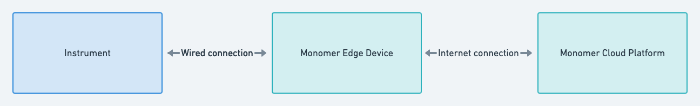
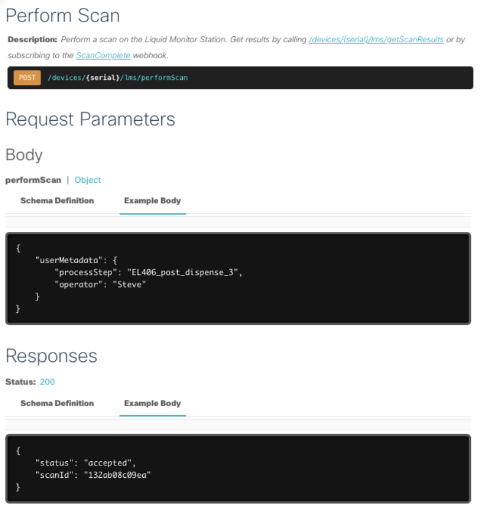
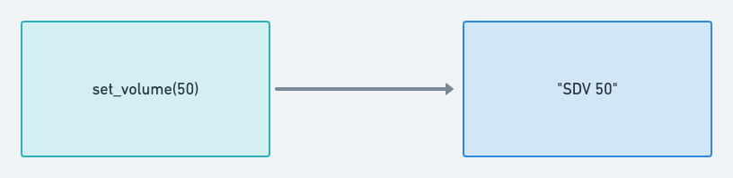
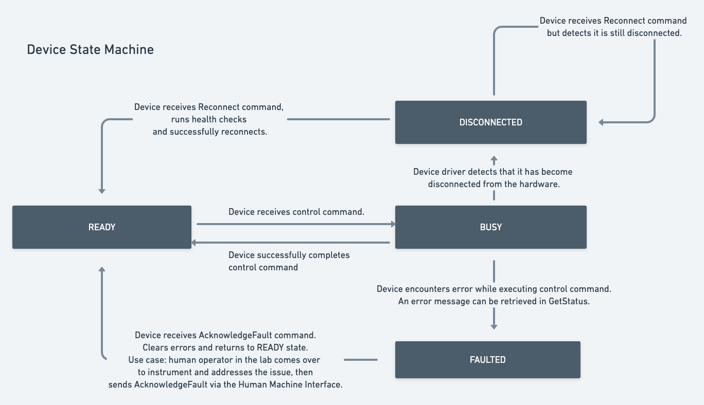
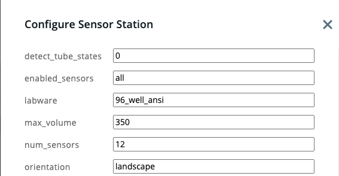
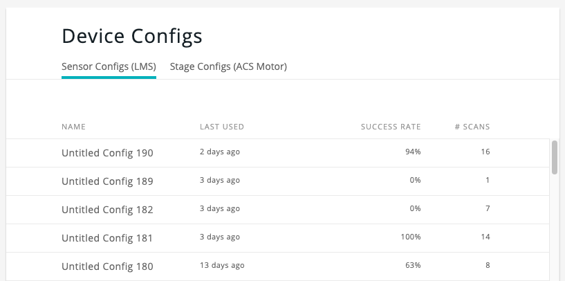
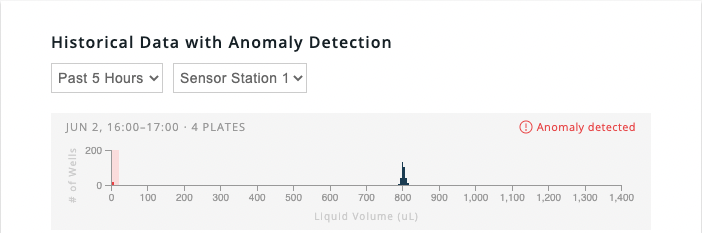

# Monomer Instrument Software SDK Overview

Monomer provides a framework for users to interact with lab instruments over the cloud.

Monomer allows instrument makers to deploy modern cloud-based APIs.

The Monomer architecture has three components:



**Monomer Edge Device** - A mini PC that sits next to your instrument. Runs processes auto-generated by the Monomer SDK to connect your instrument to the cloud.

**Monomer Cloud Platform** - Provides various cloud-based features out-of-the-box, including:
* An auto-generated REST API for your instrument.



* User analytics when customers access your instrument via the API.
* Detailed logs that record every executed command, and any warnings and errors.
* Data transfer and cloud storage for data produced by your instrument.
* Auto-generated user-interface for scientists to select and save configuration parameters.
* Webhooks allowing clients to subscribe to device events.

The **Monomer Cloud Platform** opens the possibility for:
* Developers to build apps on top of your instrument API, for example to automatically integrate your instrument with cloud-based LIMs and schedulers, or build custom scientist-facing apps for specific verticals.
* System integrators to more easily integrate your instrument into automated workcells and processes.
* Instrument makers to provide better and cheaper remote tech support.
* Instrument makers to receive better analytics based on how their instrument is being used.
* Instrument makers to charge a usage-based fee for their APIs.
* Instrument makers to build their own browser-based user interfaces using the Monomer REST API, without having to worry about security details around IoT and cloud deployments.

## How It Works

Imagine that you have a liquid dispensing instrument with a serial (RS-232) interface.

| Command | Description | Example command | Example response |
| --- | --- | --- | --- |
| DIS | Dispense liquid based on the currently set volume | DIS | DIS END 0 |
| SDV | Set volume to dispense (in μL). | SDV 50 | SDV END 0 |
<br/><br/>

### 1. Develop your instrument driver

Using the Monomer SDK, define how various commands should be translated into the serial commands recognized by your instrument.

At a high-level, what you are doing is defining this translation from command to serial command:



Here is some example code. Additional information is included in the appendix below.


```
from monomer.device import BaseDevice
from monomer.connection import ConnectionType

class DispenseInstrument(BaseDevice):
    def __init__(self) -> None:
        self.set_connection_type(ConnectionType.SERIAL)

    '''
        Dispense liquid based on the currently set volume
    '''
    @BaseDevice.control_command
    def dispense(self) -> None:
        self.connection.send("DIS")
        response = self.connection.wait_for_response(prefix="DIS")

        status_code = int(response.split(" ")[-1])

        if status_code != 0:
            raise DeviceExecutionException(f"Dispense command failed with error code {status_code})

    '''
        Set volume to dispense (in μL) on the instrument.

        Args:
            volume (int): The volume to dispense.

    '''
    @BaseDevice.config_command
    def set_volume(self, volume: int) -> None:
        self.connection.send(f"SDV {volume}")
        response = self.connection.wait_for_response(prefix="SDV")

        status_code = int(response.split(" ")[-1])

        if status_code != 0:
            raise DeviceExecutionException(f"Set volume command failed with error code {status_code})
```

### 2. Built and test your instrument driver.

Monomer provides commands to build a Docker container containing your driver, and provides a runtime environment allowing you test your Docker container locally and connected to your instrument.

### 3. Publish your instrument driver.

Once you publish your instrument driver and it has been verified by Monomer , Monomer will make your driver available on Monomer edge devices, to be sold alongside your instrument.

At this point, all of the features of the Monomer Cloud Platform described above will be available for your instrument.

### 4. Updates

Monomer automatically handles updating your instrument driver on all deployed edge devices whenever you publish a new version of your driver.

## Appendix

### Instrument State Machine

Instruments developed with the Monomer SDK distinguish between multiple types of commands.
* **Control commands** - these commands perform an action on the instrument hardware, and typically take longer to run.
* **Data commands** - these commands retrieve data from the instrument and return immediately.
* **Config commands** - these commands set a configuration variable on the instrument.

Each of these types of commands has special meaning attached to it.

For example, only one control command can be executed at a time, and control commands cause the instrument to go through the following state machine:



Every Monomer instrument comes with a set of default commands out of the box, such as `GetStatus`, `AcknowledgeFault`, and `Reconnect` for managing these state transitions and performing other common operations.

### Outbound-only architecture

Monomer instruments follow an outbound-only architecture which is the standard for IoT devices. Monomer instruments do not require any inbound ports to be opened on an organization's firewalls.

### Browser-based UIs

Monomer provides several browser-based user interfaces for instrument management out-of-the-box.

For example, users are able to edit the current instrument configuration parameters, and view previously used configurations.




### Custom applications

A whole host of custom applications can be built on top of the instrument APIs. Monomer is also working on libraries and tools for building browser-based user interfaces and data visualizations.


